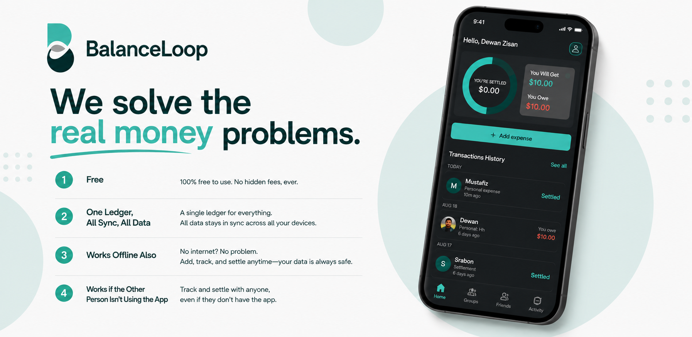
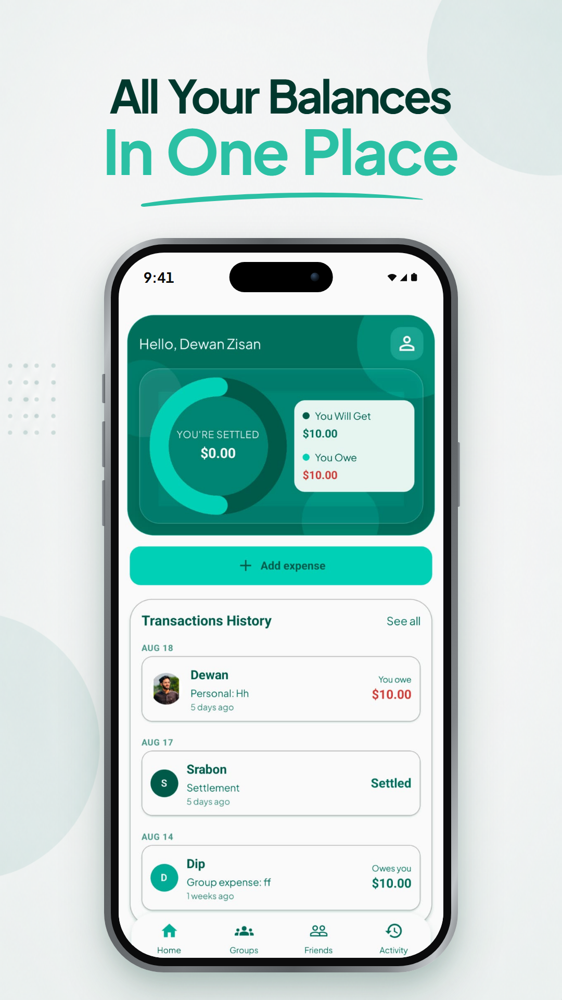
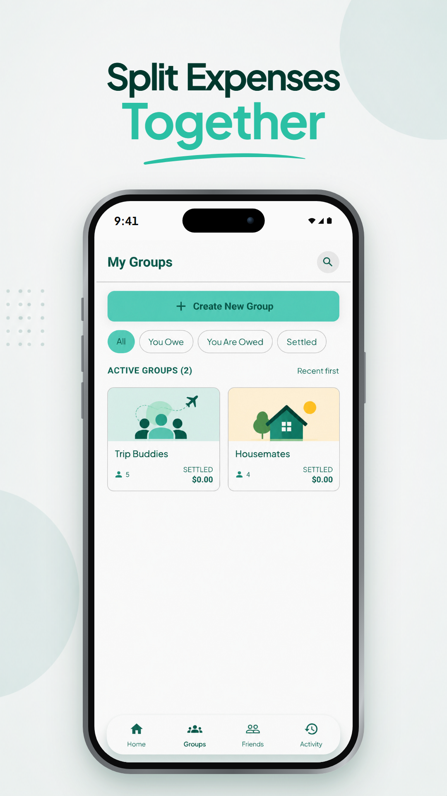
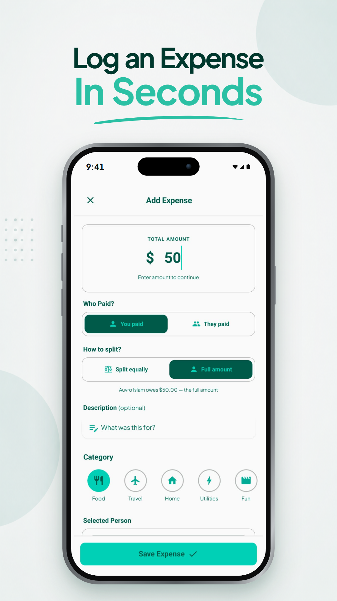
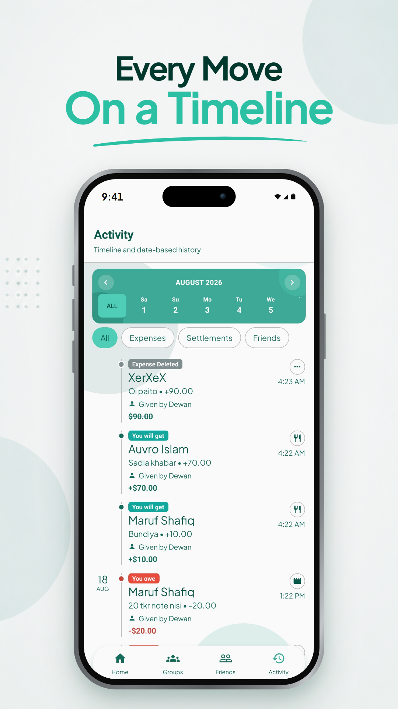
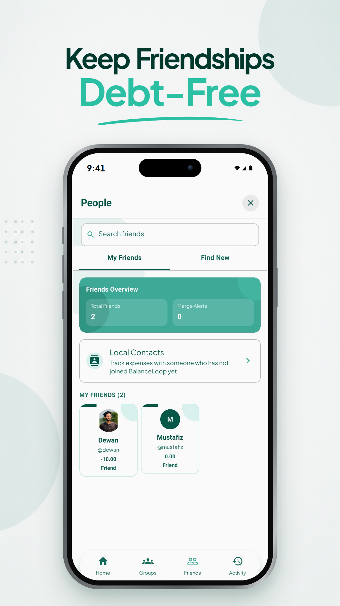
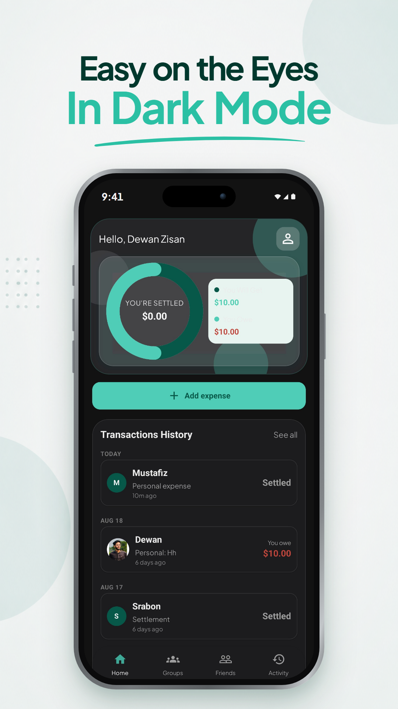

  
  <h1>BalanceLoop</h1>
  <b>Split expenses, track balances, and settle up with friends.</b>
    
  <i>Coming soon. Currently in app store review.</i>

 

---

> [!IMPORTANT]
> **The source code for BalanceLoop is private.**
> This repository is a public showcase only. It contains the project overview, screenshots, and privacy policy. It does not contain the application code, backend, or build configuration.

---

## The Problem

- Shared costs get tracked in chat threads, notes apps, and memory, then get forgotten.
- Most splitting apps put the parts you actually need behind a paywall.
- They stop working the moment you lose signal, which is exactly when the bill arrives.
- They assume everyone in the group has installed the app and made an account.
- Personal loans and group bills sit in separate ledgers, so no single number tells you where you stand.
- Settling is one-sided: one person marks a debt paid and the other has no say.

## The Solution

- **Free.** No paywall, no hidden fees, no premium tier.
- **One ledger.** Personal and group debts resolve into a single balance per person.
- **Offline first.** Entries queue on the device and sync when the connection returns.
- **Works without the other person.** Track anyone through shared local contacts found by `@username`.
- **Two-step settlement.** Both sides confirm before the ledger moves.
- **Real migration path.** When a local contact joins, merge their history into the real account with their consent.

---

## Screenshots

  
  
  

  
  
  

---

## Features

- One-to-one and group expense tracking.
- Splits: equal, custom amount, or full charge to one person.
- Multi-payer expenses with net-based balance resolution.
- Shared local contacts for people who have not joined yet.
- Consent-based merge of a local contact into a real account.
- Balance history transfer between local contacts.
- Dated activity feed for expenses, settlements, merges, and friend events.
- Push notifications for expenses, settlements, and merge requests.
- Light and dark themes.

---

## Built With

React Native · Expo · TypeScript · Supabase

---

## Download

BalanceLoop is currently in app store review. A download link will be added here once it is live.

---

## Privacy

See the [Privacy Policy](docs/privacy-policy.md).

Contact: **contact@logarithmstudio.com**

---

## License

Copyright © 2026. All rights reserved. The source code is proprietary and not available for use, copying, or distribution. See [`LICENSE`](LICENSE).
